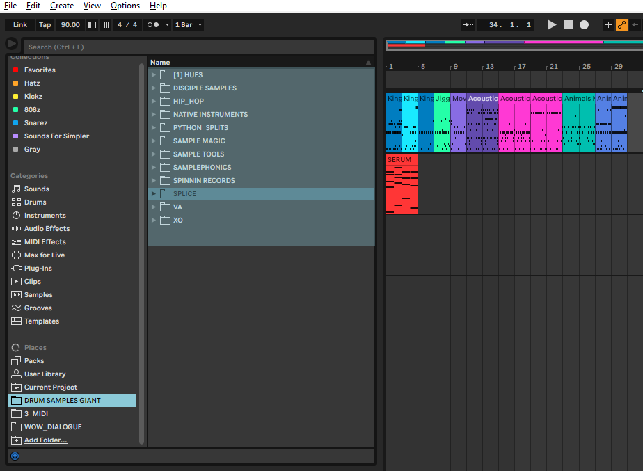
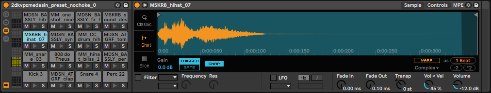

## Ableton-Drum-Rack

This module creates Drum Rack presets for [Ableton Live 11](https://www.ableton.com/en/live/)

It creates a database of samples from a given path and utilizes SQL queries to generate sample sets for the Drum Rack. 
You can specify folders, keywords and sample duration (If samples are analyzed). Sample choices are based purely on strings searches at the moment. Ex. 'kick' will match any sample the contains the word kick.

### Requirements

Ableton Live 11.

Python 3.7 or higher. (Should also work with previous versions, but tested have I not.)

### Installation

1 - Clone this repo.

2 - Inside repo folder run commands below

	python setup.py bdist_wheel
	
3 - Inside generated dist folder run 

	pip install abletondrumrack-1.0.0-py3-none-any.whl
	

### Usage

	from abletondrumrack import *
	
	# Set the Drum Rack instance.
	rack = DrumRack()  
	
	# Set the destination folder for presets to be saved. In Windows the default Drum Rack path is in the format below.
	rack.save_path = r'C:\Users\USERNAME\Documents\Ableton\User Library\Presets\Instruments\Drum Rack'

### Creating the database

You only need to create the database once. This should not take long. (Less than 1 min 373k samples)

To create a sample database you need to provide the path to your samples folder. More specifically the ones you add via Ableton. Image below. (DRUM_SAMPLES_GIANT contains all my sample folders within for example)

The database `ableton_samples.db` is created in the User folder. The table of the database is called SAMPLE_PATHS

	# Create the database.
	create_sample_database(PATH_TO_FOLDER_WITH_SAMPLES)

Columns generated. Sample size, Frames, and Length are intentionally null due to the extra time python needs extracting this information, but can be later updated.

	'FOLDER_PATH' # The path of the folder containing the sample.
	'FOLDER_NAME' # Folder name containing the sample.
	'SAMPLE_NAME' # Sample name.
	'FULL_FILE_PATH' # Full file path of the sample.
    'SAMPLE_SIZE' # Default None 
	'FRAMES' # Default None
	'LENGTH' # Default None
	'SAMPLE_HASH' # Currently not used. For comparing samples 
	'SUPPORTED' # Samples the are unable to be handled are set to 0
	
You	can now run queries to select samples

	# Example query for all samples.
	samples = query("SELECT * FROM SAMPLE_PATHS")
	
### Creating Presets

There are two functions for creating presets, make_default_drum_rack & make_drum_rack.

`make_default_drum_rack` creates a Drum Rack that resembles the default Drum Rack presets (16 pads) and the ones you download from Ableton's website. 
Pads are positioned accordingly to fit midi presets. The samples loaded try to match the generic type of the default samples.
	

The key search words can be accessed and modified in the variable rack.default_pads in dictionary format.

	# Default Pad Setup
	rack.default_pads
	"""
	{'pad1': 'kick',
	 'pad2': 'perc|clap|rim|snap',
	 'pad3': 'snare',
	 'pad4': 'perc|clap|snare',
	 'pad5': 'snare',
	 'pad6': 'bass|808',
	 'pad7': '^(?=.*hi)(?=.*hat)',
	 'pad8': 'bass|808|sub',
	 'pad9': '^(?=.*hi)(?=.*hat)',
	 'pad10': 'fx|synth|stab',
	 'pad11': '^(?=.*open)(?=.*hat)',
	 'pad12': 'tom',
	 'pad13': 'bass',
	 'pad14': 'fx|synth|stab',
	 'pad15': 'fx|synth|stab',
	 'pad16': 'fx|synth|stab'}
	 """
	 
The key words can be single strings, a combination of strings using the or '|' operator, or in regex format. (Pandas Dataframe search)

Example for replacing the key word in the first pad

	# Replace kick for bass in pad 1.
	rack.default_pads['pad1'] = 'bass'
	
To create the preset.

	# Select options. In the example below we select all the samples in the Splice folder. (Assuming you have a folder called Splice)
	samples = query("SELECT * FROM SAMPLE_PATHS WHERE FULL_PATH_NAME IS LIKE '%splice%'")
	# Provide sample set and filename. Can be called without arguments.
	rack.make_default_drum_rack(samples, fname='python_test_preset')
	
Additional info for make_default_drum_rack.

	# All arguments for function.
	"""
	rack.make_default_drum_rack(
    samples=None, # If no samples are provided samples will be chosen from the whole database.
    loginfo=False, # If loginfo is set to True frames and length of sample will be updated in the database.
    fname=False, # Default filename 'python_drum_rack_def'.
    choke=False, # If choke is set to True samples will not override each other.
	)
	"""
	
`make_drum_rack` basically just fills the pads with random samples from a given query. You can specify the amount of pads, and the starting pad. Max pads is 128. 

	# Get all samples that contain the string 'perc'.
	samples = query("SELECT * FROM SAMPLE_PATHS WHERE SAMPLE_NAME IS LIKE '%perc%'")
	# Provide sample set, slots and filename. Can be called without arguments.
	rack.make_drum_rack(samples, slots=128, fname='python_percs')

Additional info for make_drum_rack.

	# All arguments for function.
	"""
	rack.make_drum_rack(
    samples, # Sample set from query.
    slots=16, # Default slots 16, max 128.
    fname=False, # Default filename 'python_drum_rack'.
    pad=128, # Default Starting 128. the left-most lowest pad. 
    loginfo=False, # If loginfo is set to True frames and length of sample will be updated in the database.
    choke=False, # If choke is set to True samples will not override each other.
	)
	"""
	
### Adding sample folders to the database

To add a folder to the database use the add_new_samples() function.

	# Folder path needed
	add_new_samples(PATH_TO_FOLDER)
	
### Updating sample Frames and Length

With this poor implementation you can update sample frames and length using the `update_sample_details()` function. It uses the soundfile module. The problem here is time. Depending on computer and amount of samples this can take ages.
I suggest you update partially by folder and not the whole database at once. Alternative option is to set loginfo to True and update the data for the samples at creation of preset.

Update frames and length columns. (Frames for the Ableton '.adg' files, Length for queries)

	# Providing a folder within the database.
	update_sample_details(path='PATH_OF_FOLDER')

If no folder is provided it will update for all samples in the database. (Highly not suggested)

Benchmark for folder with 119k samples - Wall time: 5h 15min 55s

Interrupting the update query should have no serious effect. It will continue updating where it left off.

Further on you can use the LENGTH column for sample sets. With length you can filter out loops and very long samples for example.

	samples = query("SELECT *FROM SAMPLE_PATHS WHERE LENGTH < 1")
	
	rack.make_default_drum_rack(samples, fname='python_test_length_preset')
	
### TODO

- Optimize
- Maybe add more parameters for editing the '.adg' file
